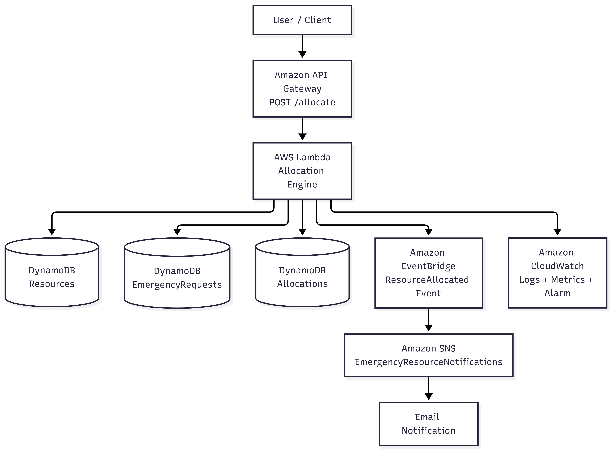

# System Architecture

## Overview

The Emergency Resource Allocation Platform follows a serverless and event-driven architecture using multiple AWS services.

The system receives resource allocation requests through Amazon API Gateway, processes them using AWS Lambda, stores application data in Amazon DynamoDB, and publishes successful allocation events through Amazon EventBridge.

Amazon SNS is used to deliver notification emails, while Amazon CloudWatch provides monitoring and logging.

---

## Architecture Diagram



---

## Architecture Flow

```text
User / Client
      |
      v
Amazon API Gateway
      |
      v
AWS Lambda
      |
      +--------------------+
      |                    |
      v                    v
DynamoDB              DynamoDB
Resources          EmergencyRequests
      |
      v
DynamoDB
Allocations
      |
      v
Amazon EventBridge
      |
      v
Amazon SNS
      |
      v
Email Notification

AWS Lambda
      |
      v
Amazon CloudWatch